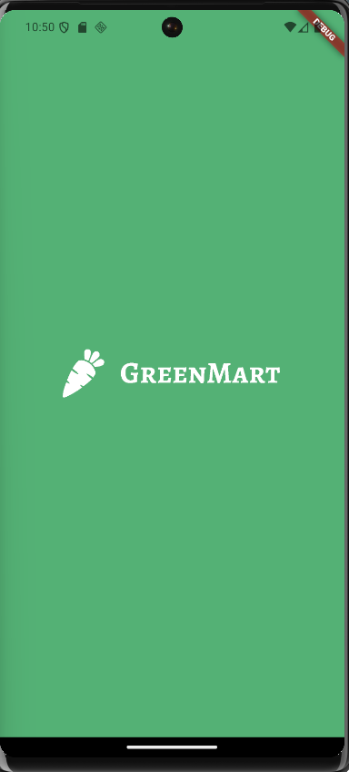
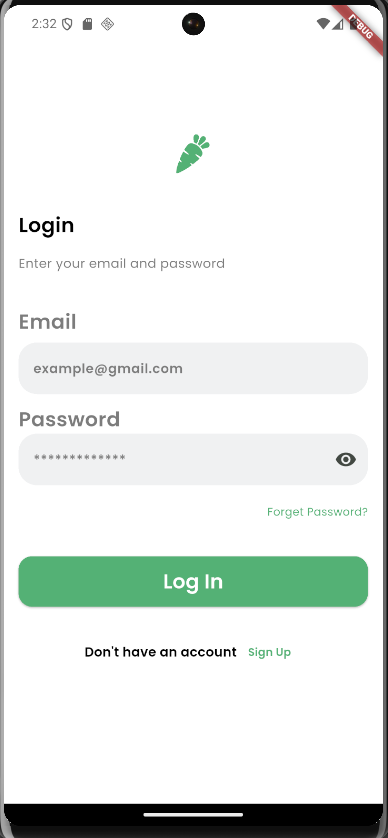
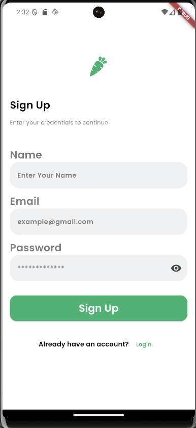
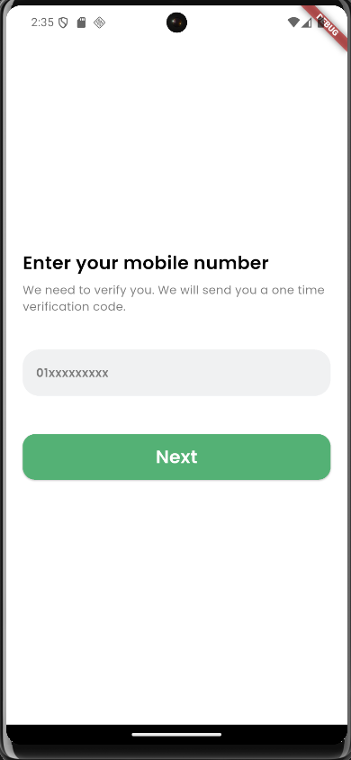
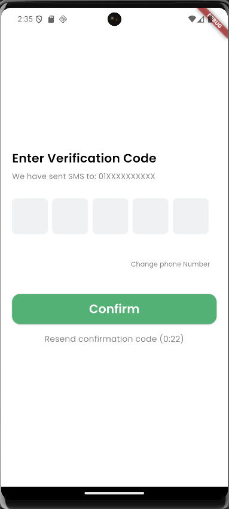
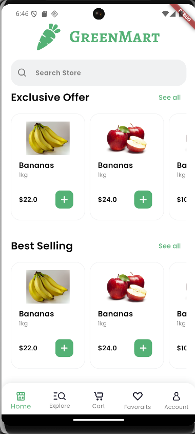
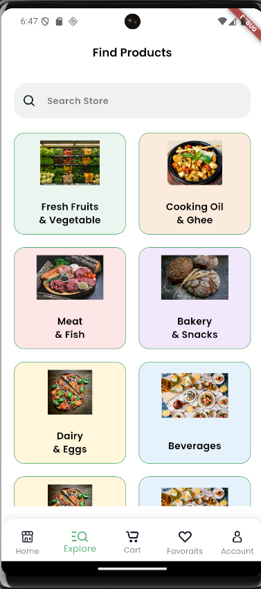
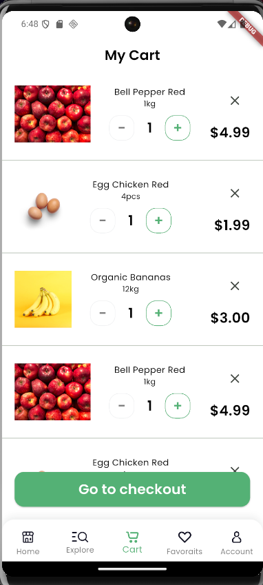
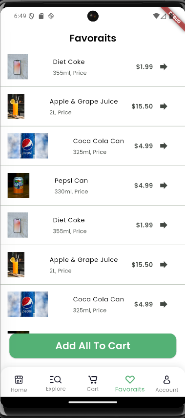
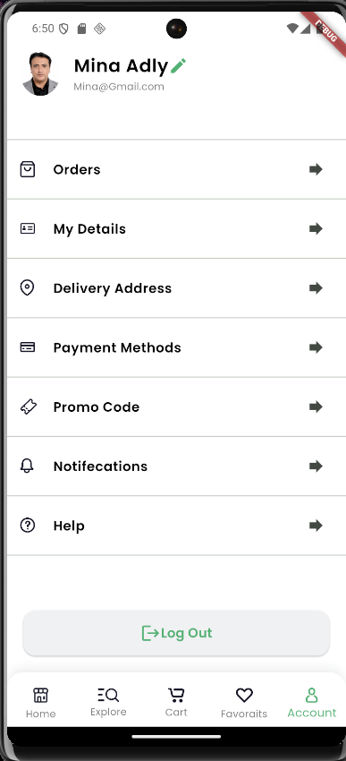

# 🥕 GreenMart

A Flutter UI implementation based on the provided Figma design.  
This project was developed through multiple Flutter course sessions and demonstrates clean UI implementation, reusable components, feature-based structure, and basic authentication flow design.

---

## ✅ Sessions Overview

### 🟢 Session 10 – Intro Flow
**Implemented Screens:**
- Splash Screen
- Onboarding Screen

### 🟢 Session 11 – Authentication Flow
**Implemented Screens:**
- Login Screen
- Sign Up Screen
- Enter Mobile Number Screen
- OTP Verification Screen

### 🟢 Session 12 – Home Module UI
**Implemented Screens:**
- Home Screen
- Explore / Categories Screen
- Favorites Screen
- Cart Screen
- Account Screen
- Bottom Navigation (Main Layout)

---

## 📸 Screenshots

### Session 10 – Intro Flow

**Splash Screen**  


**Onboarding Screen**  


---

### Session 11 – Authentication Flow

**Login Screen**  


**Sign Up Screen**  


**Enter Mobile Number Screen**  


**OTP Verification Screen**  


---

### Session 12 – Home Module UI

**Home Screen**  


**Explore / Categories Screen**  


**Cart Screen**  


**Favorites Screen**  


**Account Screen**  


---

## 🏗 Project Structure

The project follows a **feature-based structure** with clear separation of concerns:

```text
lib/
├── app_root/
│   └── app_root.dart
│
├── core/
│   ├── constants/
│   │   ├── app_fonts.dart
│   │   └── app_pictures.dart
│   ├── functions/
│   │   ├── navigations.dart
│   │   └── validations.dart
│   ├── styles/
│   │   ├── app_colors.dart
│   │   ├── app_themes.dart
│   │   └── text_styles.dart
│   └── widgets/
│       ├── custom_svg_picture.dart
│       ├── custom_text_form_field.dart
│       ├── password_text_form_field.dart
│       └── main_button.dart
│
├── features/
│   ├── auth/
│   │   ├── functions/
│   │   │   └── start_timer.dart
│   │   ├── screens/
│   │   │   ├── login_screen.dart
│   │   │   ├── sign_up_screen.dart
│   │   │   ├── number_screen.dart
│   │   │   └── verification_screen.dart
│   │   └── widgets/
│   │       ├── auth_footer.dart
│   │       └── resend_code.dart
│   │
│   └── home/
│       ├── data/
│       │   ├── product_model.dart
│       │   ├── category_model.dart
│       │   ├── category_colors.dart
│       │   ├── cart_tile_model.dart
│       │   ├── favourit_model.dart
│       │   └── account_screen_details_model.dart
│       ├── screens/
│       │   ├── home_screen.dart
│       │   ├── explore_screen.dart
│       │   ├── cart_screen.dart
│       │   ├── favoraits_screen.dart
│       │   └── accoount_screen.dart
│       └── widgets/
│           ├── item_card.dart
│           ├── category_card.dart
│           ├── cart_tile.dart
│           ├── cart_add_and_remove_items.dart
│           ├── fave_tile.dart
│           └── account_screen_tile.dart
│
├── intro/
│   └── screens/
│       ├── splash_screen.dart
│       └── onboarding_screen.dart
│
└── main/
    └── widgets/
        └── main_app_screen.dart


### Structure Explanation
- **core/** → Shared resources (colors, text styles, theme, navigation, validations, reusable widgets)
- **features/auth/** → Authentication module (UI + widgets + separated timer logic)
- **features/home/** → Home module (models/data + screens + reusable tiles/cards)
- **intro/** → Intro flow screens (Splash + Onboarding)
- **main/** → Main layout (Bottom Navigation container)

---

## ✨ Features

- Feature-based folder structure
- Clean UI implementation following a Figma design
- Reusable widgets (cards, tiles, form fields, buttons)
- Centralized colors and text styles (Theme & Styles)
- SVG asset support
- OTP input field using **Pinput**
- Countdown timer logic separated from UI
- Form validation utilities
- Basic responsive layout handling
- Bottom Navigation layout for main flow screens

---

## 📦 Dependencies

- flutter_svg
- pinput
- cupertino_icons
