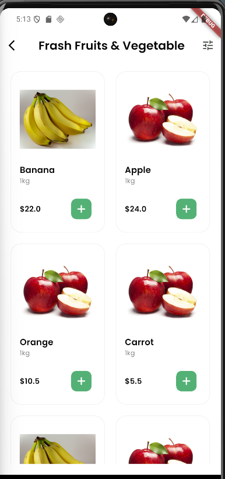
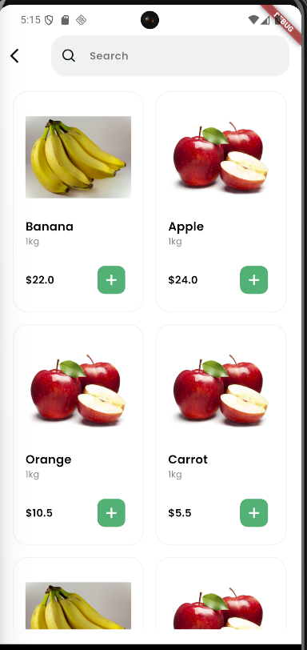
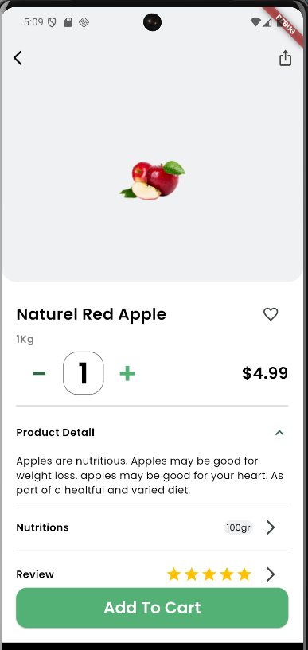
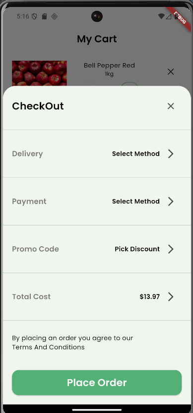

# 🥕 GreenMart

A Flutter UI implementation based on the provided Figma design.  
Built through multiple Flutter course sessions and structured in a clean, **feature-based** way with reusable widgets and centralized styling.

> This is a **UI-focused** project (screens + components + navigation flow).

---

## ✅ Sessions Overview

### 🟢 Session 10 – Intro Flow
**Implemented Screens:**
- Splash Screen
- Onboarding Screen

### 🟢 Session 11 – Authentication Flow
**Implemented Screens:**
- Login Screen
- Sign Up Screen
- Enter Mobile Number Screen
- OTP Verification Screen (with countdown timer)

### 🟢 Session 12 – Home Module UI
**Implemented Screens:**
- Home Screen
- Explore / Categories Screen
- Favorites Screen
- Cart Screen
- Account Screen
- Bottom Navigation (Main Layout)

### 🟢 Session 13 – Final App Completion
**Implemented Screens / Features:**
- Beverages Screen
- Search Screen
- Product Details Screen
- Checkout Bottom Sheet (from Cart → “Go to checkout”)
- (App flow completed ✅)

---

## 📸 Screenshots

### Session 10 – Intro Flow
**Splash Screen**  


**Onboarding Screen**  


---

### Session 11 – Authentication Flow
**Login Screen**  


**Sign Up Screen**  


**Enter Mobile Number Screen**  


**OTP Verification Screen**  


---

### Session 12 – Home Module UI
**Home Screen**  


**Explore / Categories Screen**  


**Cart Screen**  


**Favorites Screen**  


**Account Screen**  


---

### Session 13 – Final Completion
> Add these screenshots using your same naming style inside `screen_shots/`

**Beverages Screen**  


**Search Screen**  


**Product Details Screen**  


**Checkout Bottom Sheet**  


---

## 🏗 Project Structure

The project follows a **feature-based structure** with clear separation of concerns:

```text
lib/
├── app_root/
│   └── app_root.dart
│
├── core/
│   ├── constants/
│   │   ├── app_fonts.dart
│   │   └── app_pictures.dart
│   ├── functions/
│   │   ├── navigations.dart
│   │   └── validations.dart
│   ├── styles/
│   │   ├── app_colors.dart
│   │   ├── app_themes.dart
│   │   └── text_styles.dart
│   └── widgets/
│       ├── custom_svg_picture.dart
│       ├── custom_text_form_field.dart
│       ├── password_text_form_field.dart
│       └── main_button.dart
│
├── features/
│   ├── auth/
│   │   ├── functions/
│   │   │   └── start_timer.dart
│   │   ├── screens/
│   │   │   ├── login_screen.dart
│   │   │   ├── sign_up_screen.dart
│   │   │   ├── number_screen.dart
│   │   │   └── verification_screen.dart
│   │   └── widgets/
│   │       ├── auth_footer.dart
│   │       └── resend_code.dart
│   │
│   ├── home/
│   │   ├── data/
│   │   │   ├── account_screen_details_model.dart
│   │   │   ├── cart_tile_model.dart
│   │   │   ├── category_colors.dart
│   │   │   ├── category_model.dart
│   │   │   ├── favourit_model.dart
│   │   │   └── product_model.dart
│   │   ├── screens/
│   │   │   ├── account_screen.dart
│   │   │   ├── beverages_screen.dart
│   │   │   ├── cart_screen.dart
│   │   │   ├── explore_screen.dart
│   │   │   ├── favoraits_screen.dart
│   │   │   ├── home_screen.dart
│   │   │   ├── order_accepted.dart
│   │   │   └── search_screen.dart
│   │   └── widgets/
│   │       ├── account_screen_tile.dart
│   │       ├── bottom_sheet.dart
│   │       ├── bottom_sheet_tile.dart
│   │       ├── cart_add_and_remove_items.dart
│   │       ├── cart_tile.dart
│   │       ├── category_card.dart
│   │       ├── fave_tile.dart
│   │       └── item_card.dart
│   │
│   └── product_details/
│       ├── screens/
│       │   └── product_details_screen.dart
│       └── widgets/
│           ├── add_to_fav_section.dart
│           ├── counter_section.dart
│           ├── expansion_section.dart
│           ├── nutritions_section.dart
│           ├── pic_section.dart
│           └── review_section.dart
│
├── intro/
│   └── screens/
│       ├── splash_screen.dart
│       └── onboarding_screen.dart
│
├── main/
│   └── widgets/
│       └── main_app_screen.dart
│
└── main.dart

## 🏗 Structure Notes

- **core/** → Shared resources (colors, text styles, theme, navigation helpers, validations, reusable widgets)

- **features/auth/** → Authentication module (screens + widgets + separated timer logic)

- **features/home/** → Home module (data models + screens + reusable UI tiles/cards + checkout bottom sheet)

- **features/product_details/** → Product details screen split into clean reusable sections

- **intro/** → Intro flow screens (Splash + Onboarding)

- **main/** → Bottom navigation container (main layout)


---

## ✨ Features

- Feature-based folder structure
- Clean UI implementation following the Figma design
- Reusable widgets (cards, tiles, buttons, form fields)
- Centralized theme (colors + text styles)
- SVG asset support using flutter_svg
- OTP input using Pinput
- Countdown timer logic separated from UI
- Basic form validation utilities
- Bottom navigation layout for main flow
- Modular product details sections (image, counter, nutrition, review, etc.)
- Checkout bottom sheet from Cart screen

---

## 📦 Dependencies (Main)

- flutter_svg – SVG rendering  
  https://pub.dev/packages/flutter_svg

- pinput – OTP input UI  
  https://pub.dev/packages/pinput

- Flutter Documentation  
  https://docs.flutter.dev/

---

## 👤 Author

Mina Adly